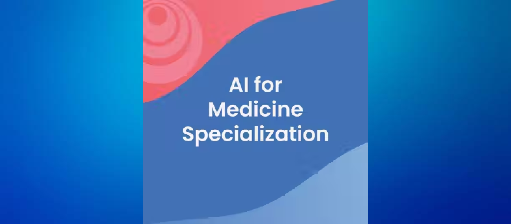

# AI for Medicine Specialization - Coursera

Welcome to my repo for the [AI for Medicine Specialization](https://www.coursera.org/specializations/ai-for-medicine) by [DeepLearning.AI](https://www.deeplearning.ai/). Here you will find my notes, labs and assignments for the specialization. 

## Outline
* [About this Specialization](#about-this-specialization)
* [Courses, Labs and Assignments](#courses-labs-and-assignments)
* [Certification](#certification)
***
## About this Specialization
AI has many practical applications in medicine, for example helping doctors diagnose patients more accurately, making predictions about patients’ future health, and recommend better treatments. In this specialization, we will 

### [Link to Specialization Notes (in English)](https://khoaguin.notion.site/AI-for-Medicine-Specialization-Coursera-DeepLearning-AI-23e9be75fc8d420e9289d5482774a3af)

## Courses, Labs and Assignments
### [Course 1 - AI for Medical Diagnosis](./ai-for-medical-diagnosis/)
#### [Week 1: Disease Detection](./ai-for-medical-diagnosis/week1-disease-detection/)
- [Lab: Data Exploration & Image Pre-Processing](./ai-for-medical-diagnosis/week1-disease-detection/labs/C1_W1_Lab_1_data_exploration_and_image_preprocessing.ipynb)
- [Lab: Counting Labels and Weighted Loss Function](./ai-for-medical-diagnosis/week1-disease-detection/labs/C1_W1_Lab_2_counting_labels_and_weighted_loss_function.ipynb)
- [Lab: DenseNet](./ai-for-medical-diagnosis/week1-disease-detection/labs/C1_W1_Lab_3_densenet.ipynb)
- [Lab: Patient Overlap & Data Leakage](./ai-for-medical-diagnosis/week1-disease-detection/labs/C1_W1_Lab_4_patient_overlap_and_data_leakage.ipynb)
- [Assignment: Chest X-Ray Medical Diagnosis with Deep Learning](./ai-for-medical-diagnosis/week1-disease-detection/assignment/)

#### [Week 2: Model Evaluation](./ai-for-medical-diagnosis/week2-evaluating-models/)
- [Lab: ROC Curve and Threshold](./ai-for-medical-diagnosis/week2-evaluating-models/labs/C1_W2_Lab_1_roc_curve%20_and_threshold.ipynb)
- [Assignment: Evaluation of Diagnostic Models](./ai-for-medical-diagnosis/week2-evaluating-models/assignment/)
#### [Week 3: MRI Image Segmentation](./ai-for-medical-diagnosis/week3-image-segmentation/)
- [Lab: Explore MRI Data & Labels](./ai-for-medical-diagnosis/week3-image-segmentation/labs/C1_W3_Lab_1_explore_mri_data_and_labels.ipynb)
- [Lab: Extract a Sub Section](./ai-for-medical-diagnosis/week3-image-segmentation/labs/C1_W3_Lab_2_extract_a_sub_section.ipynb)
- [Lab: U-Net Model](./ai-for-medical-diagnosis/week3-image-segmentation/labs/C1_W3_Lab_3_unet_model.ipynb)
- [Assignment: Brain Tumor Auto-Segmentation for Magnetic Resonance Imaging (MRI)]()

### [Course 2 - AI for Medical Prognosis](./ai-for-medical-prognosis/)

### [Course 3 - AI for Medical Treatment](./ai-for-medical-treatment/)

## Certification
