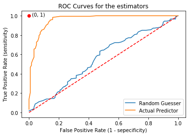

# Week 2 - Evaluating Models
In this week, we will practice implementing standard evaluation metrics to see how well a model performs in diagnosing diseases.

## Labs
### [Lab 01: ROC Curve & Threshold](./labs/C1_W2_Lab_1_roc_curve%20_and_threshold.ipynb)
The Receiver Operating Characteristic (ROC) is one of the most useful tools to evaluate medical models. It aims to measure the quality of a *binary estimator*, as it considers how the estimator is able to split between both classes, as we *vary the decision threshold*. In this lab, we will learn about the curve and its applications, as well as understand how changing the threshold of decision in a predictor impacts the outcome.

## [Assignment: Evaluation of Diagnostic Models](./assignment/)

In this assignment, we will be working with the results of the X-ray classification model we developed in the previous assignment. In order to make the data processing a bit more manageable, we will be working with a subset of our training, and validation datasets. We will also use our manually labeled test dataset of 420 X-rays.

As a reminder, our dataset contains X-rays from 14 different conditions diagnosable from an X-ray. We'll evaluate our performance on each of these classes using the classification metrics we learned in lecture.

By the end of this assignment, we will learn about:
- Accuracy
- Prevalence
- Specificity & Sensitivity
- PPV and NPV
- ROC curve and AUCROC (c-statistic)
- Confidence Intervals

### Requirements
`numpy==1.18.1`  
`pandas==0.25.3`  
`sklearn==0.22.1`  
