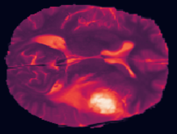
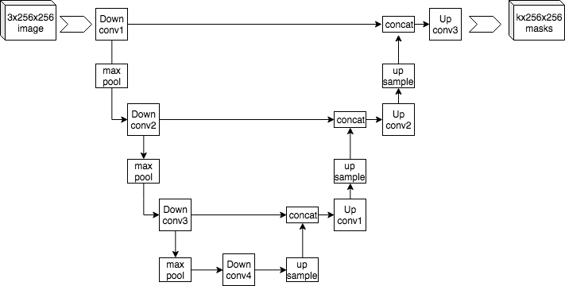

# Week 3 - Image Segmentation on MRI Images
In this week, we will practice preparing 3D MRI data, implement an appropriate loss function for image segmentation, and apply a pre-trained U-net model to segment tumor regions in 3D brain MRI images.

## Labs
### [Lab 01: Explore MRI Data and Labels]()
In this week's assignment, we'll be working with 3D MRI brain scans from the public [Medical Segmentation Decathlon](https://decathlon-10.grand-challenge.org/) challenge project. This is an incredibly rich dataset that provides labels associated with each point (voxel) inside a 3D representation of a patient's brain. Ultimately, in this week's assignment, we will train a neural network to make three-dimensional spatial segmentation predictions for common brain disorders.

### [Lab 02: Extract a Sub Section]()
In this week's assignment, we will be extracting sub-sections of the MRI data to train your network. The reason for this is that training on a full MRI scan would be too memory intensive to be practical. To extract a sub-section in the assignment, we will need to write a function to isolate a small "cube" of the data for training. This example is meant to show you how to do such an extraction for 1D arrays. In the assignment we will apply the same logic in 3D.

### [Lab 03: U-Net Model]()
In this week's assignment, we'll be using a network architecture called "U-Net". The name of this network architecture comes from it's U-like shape. U-nets are commonly used for image segmentation. In this lab, we will learn more about the U-net. 

## Assignment: