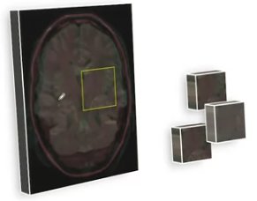
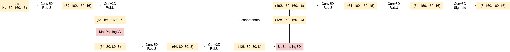

# Week 3 - Image Segmentation on MRI Images
In this week, we will practice preparing 3D MRI data, implement an appropriate loss function for image segmentation, and apply a pre-trained U-net model to segment tumor regions in 3D brain MRI images.

## Labs
### [Lab 01: Explore MRI Data and Labels](./labs/C1_W3_Lab_1_explore_mri_data_and_labels.ipynb)
In this lab, we will be exploring the 3D MRI scans from the [Medical Segmentation Decathlon](https://decathlon-10.grand-challenge.org/) challenge project. This is an incredibly rich dataset that provides labels associated with each point (voxel) inside a 3D representation of a patient's brain. Ultimately, in this week's assignment, we will train a neural network to make three-dimensional spatial segmentation predictions for common brain disorders.

### [Lab 02: Extract a Sub Section](./labs/C1_W3_Lab_2_extract_a_sub_section.ipynb)
Training a neural network on a full MRI scan would be too memory intensive to be practical. Therefore, we will need to extract sub-sections of the MRI data to train the network. This lab shows an example of how to do such an extraction for 1D arrays. In the assignment we will apply the same logic in 3D.

### [Lab 03: U-Net Model](./labs/C1_W3_Lab_3_unet_model.ipynb)
In this week's assignment, we'll be using a network architecture called "U-Net". The name of this network architecture comes from its U-like shape. U-Nets are commonly used for image segmentation. In this lab, we will learn more about the U-Net.

## Assignment: Brain Tumor Auto-Segmentation for Magnetic Resonance Imaging (MRI)